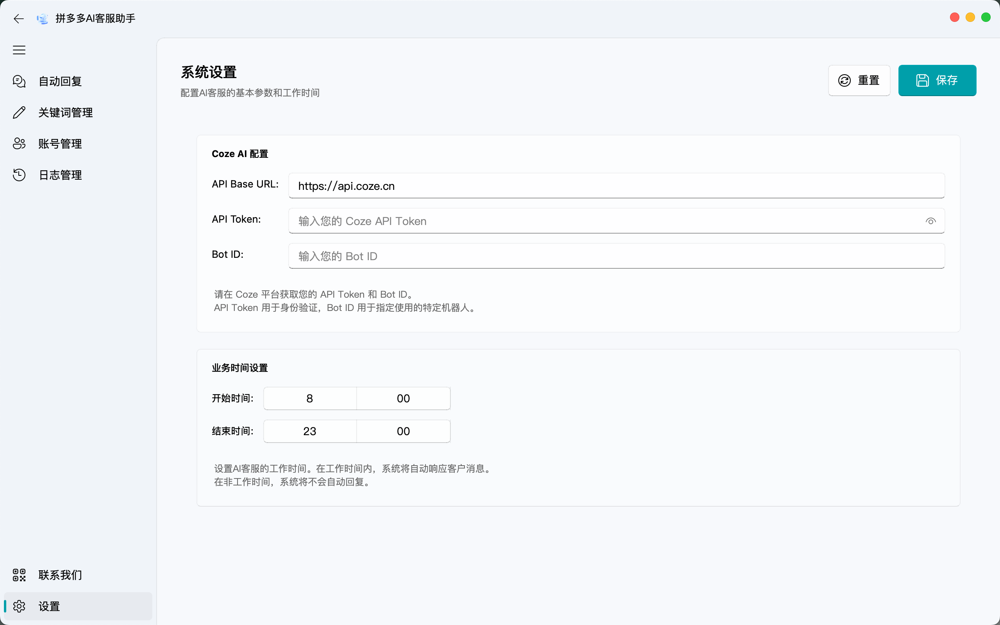
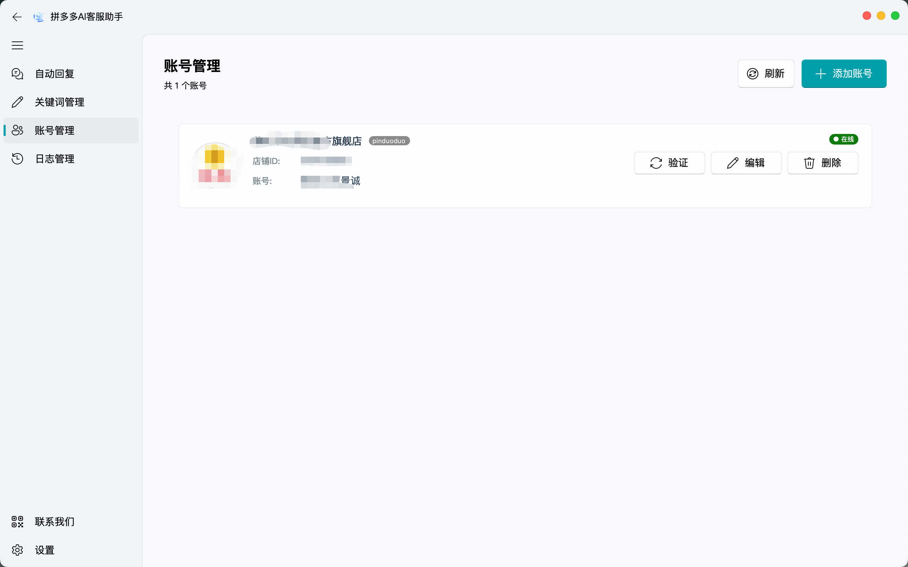
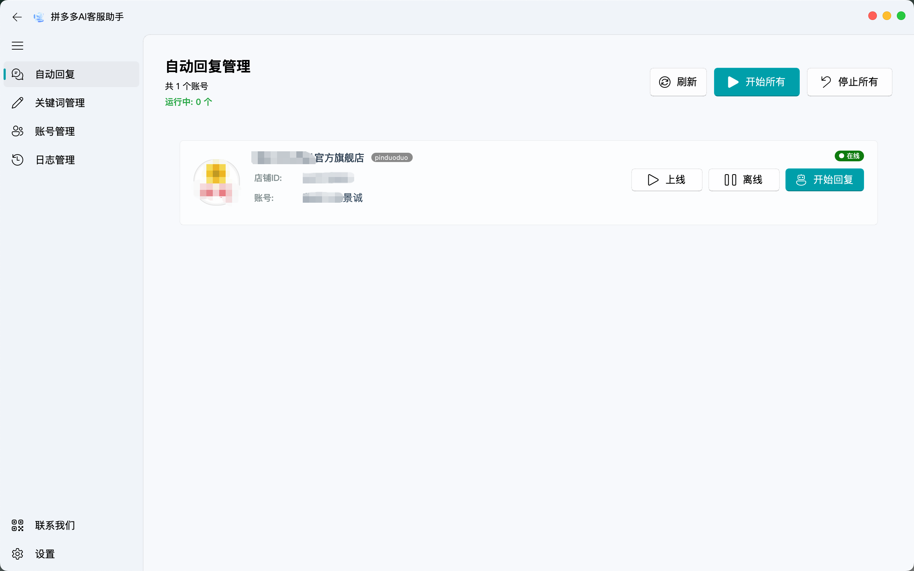
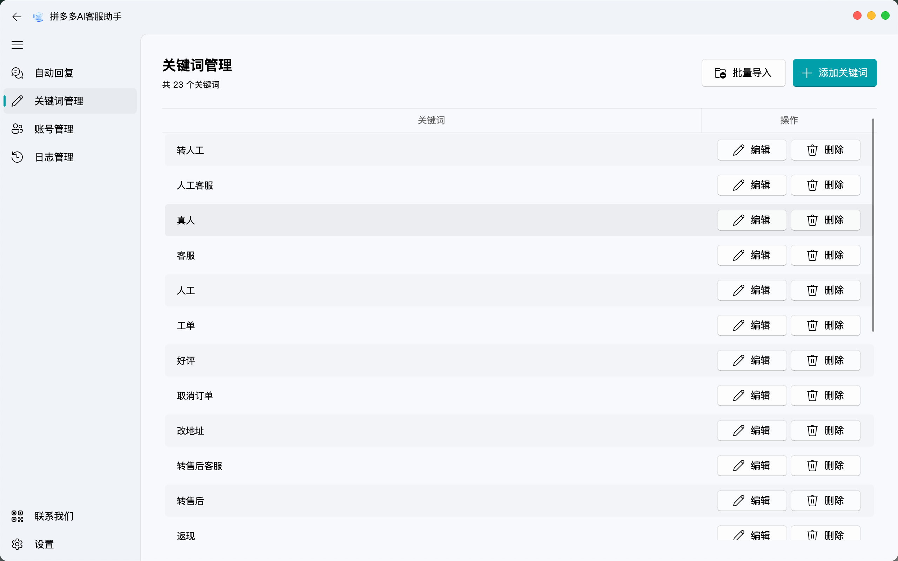
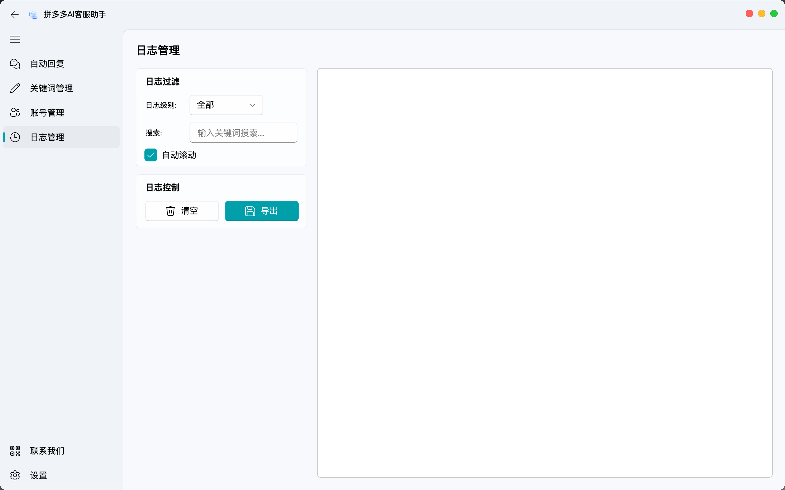
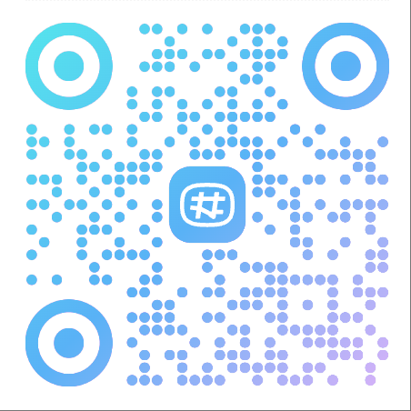
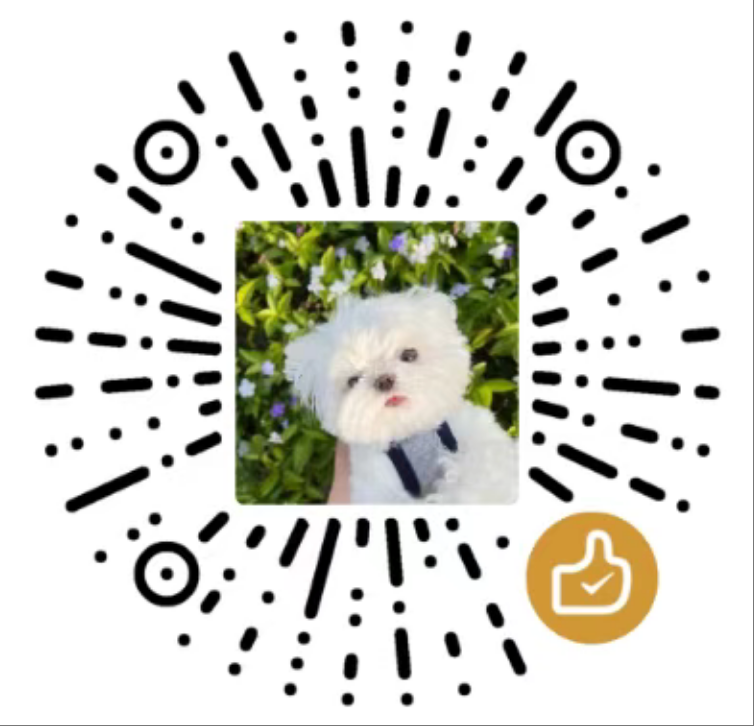

# 🤖 智能客服系统

<div align="center">
  
  <p><em>智能客服系统 - 提升客服效率的智能化解决方案</em></p>
</div>

## 📖 项目简介

智能客服系统是一个专为电商平台设计的综合性客户服务管理工具。本系统通过AI技术和自动化流程，显著提高客服工作效率，实现智能回复的同时保留人工介入的灵活性，为商家提供完整的客服解决方案。

## ✨ 主要功能

### 🔐 账号管理
- 商家账号管理（支持多账号）
- 自动登录获取cookies
- 账号状态实时监控

<div align="center">
  
  <p><em>账号管理 - 管理您的拼多多商家账号</em></p>
</div>

### 💬 智能消息处理
- 实时消息监控与自动回复
- 集成AI (Coze API) 生成智能回复内容
- 支持自定义回复模板和关键词识别

<div align="center">
  
  <p><em>智能回复 - 自动回复客户消息</em></p>
</div>

### 🔄 智能转接系统
- 基于关键词智能识别客户需求
- 自动将复杂问题转接给人工客服
- 无缝衔接确保服务质量

<div align="center">
  
  <p><em>关键词管理 - 智能识别转接需求</em></p>
</div>

### 📊 系统监控
- 实时日志记录
- 系统运行状态监控
- 详细的操作记录和统计

<div align="center">
  
  <p><em>日志界面 - 实时监控系统运行状态</em></p>
</div>

## 🚀 快速开始

### 环境要求
- Python 3.11+
- macOS 10.15+ / Windows 10/11 / Linux
- 网络连接稳定

### 安装步骤

1. **克隆项目**
   ```bash
   git clone https://github.com/JC0v0/Customer-Agent.git
   cd Customer-Agent
   ```

2. **安装依赖**
   ```bash
   # 使用uv进行环境配置（推荐）
   pip install uv
   uv venv
   uv sync
   
   # 或使用pip
   pip install -r requirements.txt
   ```

3. **安装浏览器驱动**
   ```bash
   uv run playwright install chrome
   # 或
   playwright install chrome
   ```


## 📱 使用指南

### 启动系统（新版）
```bash
python main.py
```

### 项目结构
```
easy-kefu/
├── src/                 # 源代码主目录
│   ├── core/           # 核心模块（agents/channels/messages/bridge）
│   ├── ui/             # 用户界面
│   ├── db/             # 数据库
│   ├── services/       # 业务服务（knowledge/learning）
│   └── utils/          # 工具函数
├── config/             # 配置文件
├── resources/          # 资源文件（icons/docs）
├── scripts/            # 工具脚本
├── tests/              # 测试代码
└── main.py            # 主入口文件
```

详细结构说明请看 [PROJECT_STRUCTURE.md](PROJECT_STRUCTURE.md)

### 配置流程

1. **配置商家账号**
   - 在账号管理界面配置您的拼多多商家账号
   - 系统将自动获取并保存登录凭证

2. **设置关键词规则**
   - 配置需要人工转接的关键词
   - 设置自动回复的话术模板

3. **配置Coze API**
   - 在设置界面配置Coze API
   - 设置Coze API

4. **启动系统**
   - 在账号管理界面启动系统
   - 系统将根据配置自动处理消息

5. **监控日志**
   - 在日志管理界面查看系统运行日志


## 🛠️ 技术架构

- **前端界面**: qfluentwidgets
- **后端逻辑**: Python
- **AI集成**: Coze API
- **数据存储**: SQLite + JSON
- **浏览器自动化**: Playwright

## 📁 项目结构

```
easy-kefu/
├── src/                      # 源代码主目录
│   ├── core/                # 核心业务流程
│   │   ├── agents/          # AI机器人（Coze/Kimi/Qwen）
│   │   ├── channels/        # 渠道接口（拼多多等）
│   │   ├── messages/        # 消息队列与处理
│   │   └── bridge/          # 业务桥接层
│   ├── ui/                  # 用户界面（PyQt6）
│   ├── db/                  # 数据库（SQLAlchemy）
│   ├── services/            # 业务服务层
│   │   ├── knowledge/       # 知识库与RAG检索
│   │   └── learning/        # AI学习优化
│   └── utils/               # 工具函数
├── config/                  # 配置文件
│   ├── config.json          # 主配置
│   └── config.py            # 配置管理器
├── resources/               # 静态资源
│   ├── icons/              # 图标文件
│   └── docs/               # 文档图片
├── scripts/                 # 工具脚本
│   ├── build_dmg.py        # 打包脚本
│   └── *.spec              # PyInstaller配置
├── tests/                   # 测试代码
├── docs/                    # 项目文档
├── database/                # 数据库文件（运行时生成）
├── logs/                    # 日志文件（运行时生成）
├── main.py                  # 主入口文件
├── pyproject.toml          # 项目依赖
└── PROJECT_STRUCTURE.md    # 结构说明文档
```

更多详情请查看 [PROJECT_STRUCTURE.md](PROJECT_STRUCTURE.md)

## 🤝 贡献指南

我们欢迎所有形式的贡献！如果您想参与项目开发：

1. Fork 本仓库
2. 创建您的特性分支 (`git checkout -b feature/AmazingFeature`)
3. 提交您的更改 (`git commit -m 'Add some AmazingFeature'`)
4. 推送到分支 (`git push origin feature/AmazingFeature`)
5. 开启一个 Pull Request

## 📄 许可证

本项目采用 MIT 许可证 - 详情请见 [LICENSE](LICENSE) 文件。

## 📞 联系我们

- **问题反馈**: [GitHub Issues](https://github.com/JC0v0/PDD-customer-bot/issues)
- **功能建议**: 欢迎通过 Issues 提出您的想法
- **技术交流**: 
<div align="center">
  
  <p><em>频道二维码</em></p>
</div>

## 💖 支持项目

如果这个项目对您有帮助，您可以通过以下方式支持我们：

<div align="center">
  
  <p><em>您的支持是我们前进的动力</em></p>
</div>

---

<div align="center">
  <p>⭐ 如果这个项目对您有帮助，请给我们一个星标！</p>
  <p>Made with ❤️ by <a href="https://github.com/JC0v0">JC0v0</a></p>
</div>
